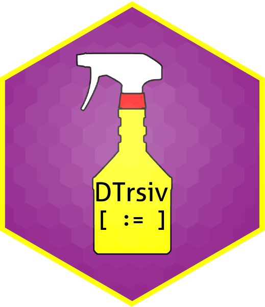

# DTrsiv   

_**DTrsiv** is a R package containing a collection of R data.table functions available to quickly and easily clean your data._  
**Everyone who wants is welcome to contribute!**

**Author: PAGEAUD Y.<sup>1</sup>**  
**Contributors:** Everyone who wants is welcome to contribute!  
**1-** [**DKFZ - Division of Applied Bioinformatics, Germany.**](https://www.dkfz.de/en/applied-bioinformatics/index.php)  

**Version: 0.0.24 (Beta)**  
**R Compatibility: R version 3.6.3 (2020-02-29) -- "Holding the Windsock"**  
**Last Update: 28/08/2020**  

## Install

```bash
git clone https://github.com/YoannPa/DTrsiv.git
```

Go to the directory and and open the file 'DTrsiv.Rproj' in RStudio.  
Install devtools and data.table packages:  
```R
install.packages(pkgs = c("devtools", "data.table"))
```

Install DTrsiv:  
```R
devtools::install()
```

Load DTrsiv:
```R
library(DTrsiv)
```

The DTrsiv functions should be available in your environment.

## Content
`dt_fun.R` script contains functions related to R data.table formating:  
* `dt.sub()` for pattern matching and substitution applied on data.table object column-wise. It first identifies the columns containing any occurence matching the pattern and then applies the substitution considering only columns where the pattern matched, thus shortening execution time on data.table with many columns. It supports columns of type list.  
* `dt.ls2c()` converts data.table columns of type list to a type vector.  
* `dt.rm.dup()` removes duplicated columns based on their content (not on their names).  
* `dt.rm.allNA()` removes columns exclusively containing NAs from a data.table.  
* `dt.int64tochar()` converts columns of 'double.integer64' type into 'character' type.  
* `dt.combine()` combines values of partially duplicated columns from a data.table into new columns.  

`dt_chk.R` script contains functions related to checking a R data.table content:  
* `allNA.col()` checks if any column contains exclusively NAs and returns their names if any with a warning.  
* `best.merged.dt()` looks for the best merging operation(s) between two data.tables trying a set of columns from the second one.  

## Problems ? / I need help !
For any questions **Not related to bugs or development** you can write me at [y.pageaud@dkfz.de](y.pageaud@dkfz.de).
 
## Technical questions / Development / Feature request
If you encounters issues or a feature you would expect is not part of DTrsiv functions available, please go to the [DTrsiv Github repository](https://github.com/YoannPa/DTrsiv) click on the tab **Issues** and create an issue.  

## References
1. Introduction to data.table: [https://cran.r-project.org/web/packages/data.table/vignettes/datatable-intro.html](https://cran.r-project.org/web/packages/data.table/vignettes/datatable-intro.html)  
2. Official R data.table Github repository: [https://github.com/Rdatatable/data.table](https://github.com/Rdatatable/data.table)  
3. [_By-Group Processing, the R data.table and the Power of Open Source_ (22.02.2011) - Steve Miller](https://www.information-management.com/opinion/by-group-processing-the-r-datatable-and-the-power-of-open-source)  

## Licence
The repository DTrsiv is currently under the GPL-3.0 licence.  

